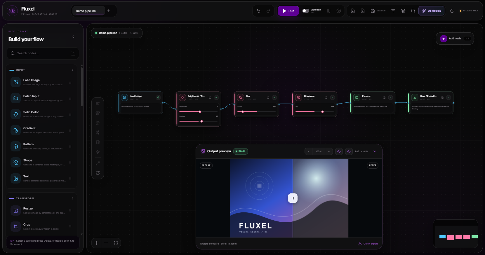
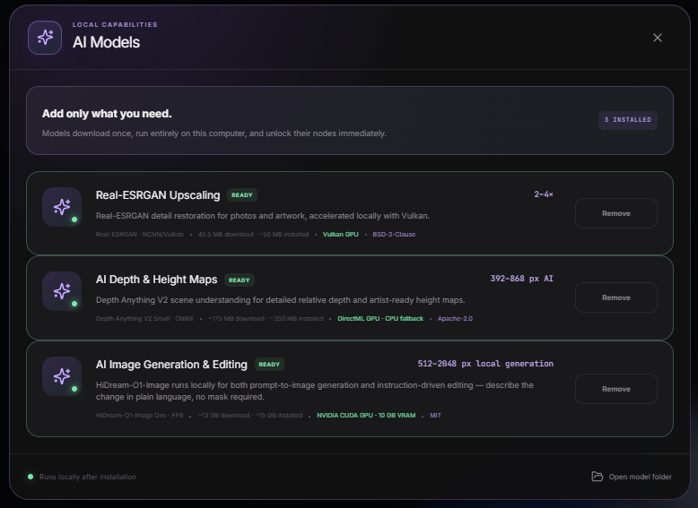

<div align="center">

# Fluxel

**A visual, node-based image-processing studio that runs entirely on your machine.**

Build a typed node graph, run a real image pipeline, compare before/after, and export — with no backend, no account, and no data leaving your computer.

[](https://github.com/emlore1/Fluxel/releases/latest)
[](https://github.com/emlore1/Fluxel/actions)
[](LICENSE)


</div>

<!-- TODO: replace with a real screenshot of the node canvas -->
<!-- Recommended: 1600px wide, showing a populated graph + the output monitor -->


---

## Download

**[⬇ Download Fluxel for Windows](https://github.com/emlore1/Fluxel/releases/latest)** — portable `.exe`, no installer, no admin rights.

Unzip nothing, install nothing: download and run. AI features are optional add-on packs you install from inside the app (see [Local AI](#local-ai)).

---

## What it does

Fluxel is a node editor for images. You drag nodes onto a canvas, wire them together, and the graph executes as a real pipeline — every image node does genuine pixel work in a Web Worker, not a CSS filter preview.

- **Typed node graph** — connections are validated by type; incompatible ports won't link
- **Real processing** — Levels, Curves, Color Grade, blurs with true pixel kernels, blend modes, masking
- **Before/after comparison** — aspect-correct, full-size layered comparison with a draggable split
- **Batch folders** — point at a directory and run the whole graph over every image, streamed one at a time
- **Local AI nodes** — upscaling, depth maps, and image generation/editing, all running on your own GPU
- **Desktop or browser** — the same editor runs as an Electron app or in a browser tab

---

## Local AI



Open **AI Models** in the top toolbar to install optional, hash-verified feature packs. Models are stored separately from the executable, so updating Fluxel never means re-downloading them. Every pack is SHA-256 verified, resumable, and removable from the same panel.

| Pack | Node | Size | Requires |
| --- | --- | --- | --- |
| Real-ESRGAN | Upscale 2×–4× | 45.5 MB | Vulkan GPU (Intel/AMD/NVIDIA), Windows |
| Depth Anything V2 Small | AI Depth / Height Map | 94.8 MB | Any GPU via DirectML, CPU fallback |
| HiDream-O1-Image | AI Generate, AI Edit | provisioned on install | NVIDIA CUDA, ~10 GB VRAM, Windows |

Nothing ships inside the installer, and no pack requires an account or an internet connection once installed.

<details>
<summary><b>Real-ESRGAN Upscale</b> — neural detail restoration</summary>

<br>

A genuine 2×–4× neural detail-restoration node powered by the official portable Real-ESRGAN NCNN/Vulkan runtime. Includes **General Photo**, **Anime / Artwork**, and **Anime Fast** models, with selectable GPU-memory tiling, adjustable detail strength, transparency preservation, progress reporting, and pipeline cancellation.

Needs no Python, PyTorch, CUDA, or account. General Photo and Anime / Artwork are native 4× networks — Fluxel runs them at 4× and performs a high-quality final reduction when you request 2× or 3×, which avoids the tile-placement artifacts a direct low-factor run produces. Anime Fast uses its dedicated native x2/x3/x4 weights directly.

</details>

<details>
<summary><b>AI Depth / Height Map</b> — Depth Anything V2</summary>

<br>

A single local inference exposes separate **Depth** and **Height** outputs at the source image dimensions. Depth polarity, height direction, contrast, gamma, smoothing, and CPU-only processing are all selectable in the node.

Automatic processing tries DirectML GPU acceleration on Windows and falls back to CPU safely. **Fast**, **Balanced**, **Fine**, and **Ultra** quality modes preserve the source aspect ratio, inferring at a 392–868 px short edge before returning the map at original dimensions.

It participates in normal graphs, caching, cancellation, and folder batch processing like any other node.

</details>

<details>
<summary><b>AI Generate & AI Edit</b> — HiDream-O1-Image, local GPU</summary>

<br>

**AI Generate** is a source node: it needs no input and emits a freshly generated image, so it can head a graph the way Load Image does. Fixed seeds are reproducible and increment across folder-batch runs.

**AI Edit** takes an image plus a plain-language instruction — *"remove the car"*, *"make it snow"* — and applies it to the whole frame, with no mask to paint. Paint Mask remains available as a utility node; mask-scoped editing is planned for a later release.

Output size comes from a fixed table the model selects by aspect ratio, so the node lists those eleven sizes rather than a width and height it would discard. Steps, guidance, and shift are pinned to the values the checkpoint was tuned for, and the pipeline takes no negative prompt.

**How the runtime is provisioned.** This is a PyTorch model, not a single binary, so the pack builds its own runtime on first install: standalone CPython, a CUDA build of PyTorch, a matching flash-attention wheel, the upstream `models` package, and the checkpoint. No system Python, pip, CUDA toolkit, git, or `huggingface_hub` required — just a current NVIDIA driver.

**Performance.** Weights are FP8, keeping VRAM near 10 GB. Since torch won't mix FP8 with BF16 activations, each linear layer dequantises as it runs. Generation happens in a warm worker reused between runs and released after ten idle minutes, so only the first image of a session waits on the model load. The worker is fully offline and excludes the upstream prompt agent, which would send prompts to a hosted LLM.

**Requirements and limits.** NVIDIA CUDA GPU, ~10 GB VRAM, Windows only — unlike the Vulkan and DirectML packs. If no flash-attention wheel matches the installed torch, the pipeline falls back to masked attention automatically; images still generate, but fine texture suffers. The distilled FP8 checkpoint also trades some fidelity for speed, most visible when editing photos.

</details>

See [THIRD_PARTY_NOTICES.md](THIRD_PARTY_NOTICES.md) for runtime and model licensing.

---

## Nodes

**Sources** — Load Image, Solid Color, Gradient, Pattern, Shape, Text, AI Generate

**Tone & color** — Levels (input/output tonal remapping with gamma), Curves (draggable, keyboard-accessible five-point RGB/channel editor), Color Grade (exposure, gamma, temperature, tint)

**Filters** — Gaussian Blur, Motion Blur, Unsharp Mask — all worker-backed with real pixel kernels

**Composite** — Blend Images (Normal, Multiply, Screen, Overlay, Difference), Apply Mask (converts a second image's luminance into a resampled, invertible, feathered alpha mask), Paint Mask (passes the image through while producing a reusable grayscale mask from a brush editor)

**Transform** — Resize (percentage by default; pixel mode takes a target width *or* height and derives the other from source aspect)

**AI** — Real-ESRGAN Upscale, AI Depth / Height Map, AI Generate, AI Edit

**Output** — Preview, Save / Export Image (PNG, JPEG, WebP)

**Organisation** — Macro (collapse a single-input image chain into a reusable node that executes and caches like a normal one, expandable back onto the canvas), Group frames

---

## Editor

<details>
<summary><b>Canvas & graph editing</b></summary>

<br>

- Open the searchable, categorized node menu with **Add node** or `Shift + A`
- Connecting to an occupied input replaces its previous connection
- Drop a cable on empty canvas to open a type-compatible node menu — the chosen node is inserted at the drop point and connected automatically
- Disconnect by selecting a cable and pressing `Delete`/`Backspace`, using **Disconnect**, or double-clicking it
- Drop a compatible library node directly onto a cable to insert it into that connection
- Drop an existing unconnected node onto a widened cable target to insert it; the downstream branch shifts smoothly to 400px spacing, respecting reduced-motion preferences
- Replace a selected node's type from the inspector while retaining all compatible connections
- Bypass or re-enable a node without rewiring
- Group nodes into a movable frame, collapse/expand, or ungroup without changing connections
- Auto-arrange a graph by its DAG execution order
- Copy and paste connected selections across graphs or browser tabs
- Command palette on `Ctrl/Cmd + K`

</details>

<details>
<summary><b>Preview & inspection</b></summary>

<br>

- The output panel appears whenever the active graph contains a Preview node, including a waiting state before output exists
- Before/after comparison preserves source aspect ratio and letterboxes rather than cropping square or portrait output
- Comparison uses two full-size layers with endpoint-safe clipping — 0% shows only the processed image, 100% only the original
- Before and after keep independent aspect ratios; the clipped Before layer carries an opaque matte so the processed layer can't leak through letterbox space
- Pin any image-producing node to the preview, then zoom with the wheel and pan with `Shift`-drag
- Toggle an RGB/luminance histogram over processed output, inspect average channel values, and sample exact pixels with the eyedropper
- Node cards display their latest execution time after a successful run
- Nodes with an empty required parameter or missing connection get a red outline and warning badge before Run

</details>

<details>
<summary><b>Batch processing</b></summary>

<br>

- **Batch Input** selects only the source folder, then executes the complete DAG sequentially for every supported image in it
- Batch runs require an active **Save / Export Image** node with an export directory. All naming, format, quality, and location settings live in that Save node, and multiple Save nodes can write separate branch outputs
- Each result is written immediately with collision-safe naming; Fluxel releases the per-image cache and advances rather than holding every encoded image in memory
- The batch panel reports saved files and can open the Save node's folder
- The built-in **Batch Resizer** template is an immediately usable batch workflow

</details>

<details>
<summary><b>Sessions & preferences</b></summary>

<br>

- A pre-wired demo pipeline runs once when Fluxel opens
- **Auto run** is a global toggle in the top toolbar, disabled by default; manual **Run** is always available
- Theme, accent, reduced-motion, and auto-run changes are session-only until **Save Preferences** is pressed in Appearance
- Graph edits are session-only. **Save Startup File** chooses the project that opens on future launches; **Clear Startup File** restores the built-in demo
- **Restore Factory Settings** resets preferences, the startup file, and the current session — without deleting custom templates or downloaded JSON files
- Every graph tab has a delete control; deletion requires confirmation and Fluxel always keeps at least one graph
- Download/load JSON is the portable project save workflow, independent of the browser-local startup file
- The template gallery loads built-in workflows or saves reusable custom templates locally

</details>

### Shortcuts

| Action | Shortcut |
| --- | --- |
| Run pipeline | `Ctrl/Cmd + Enter` |
| Open add-node menu | `Shift + A` |
| Open command palette | `Ctrl/Cmd + K` |
| Undo | `Ctrl/Cmd + Z` |
| Redo | `Ctrl/Cmd + Shift + Z` or `Ctrl/Cmd + Y` |
| Duplicate selection | `Ctrl/Cmd + D` |
| Copy selection | `Ctrl/Cmd + C` |
| Paste selection | `Ctrl/Cmd + V` |
| Bypass selected node | `B` |
| Delete selection | `Delete` or `Backspace` |

---

## Design

Fluxel uses its own *Orbit desk* visual system: detached rounded work surfaces, a neutral-black canvas, capsule navigation, vertically accented node tiles, a card-based inspector, and a floating output monitor. The default accent is `#5e0094`.

---

## Building from source

```bash
npm install
npm run dev          # browser dev server
npm run build        # static production build
npm run desktop:dev  # Electron app in development
npm test             # full test suite
npm run desktop:dist:win   # portable Windows .exe
```

> **What's in this repository.** The Electron shell, the IPC layer, and the entire Python-based AI runtime (`electron/`, `python/`) are full, editable source — that's the substance of this project. The UI itself (`main.js`) ships as an already-built bundle rather than individual component files; there is no `src/` tree behind it here, so it can be read and patched in place but not rebuilt from scratch from this repository. It is compiled from React, React Flow, Zustand, and Framer Motion — see [THIRD_PARTY_NOTICES.md](THIRD_PARTY_NOTICES.md) for attribution.

**Tech** — React, React Flow, Zustand, Framer Motion, Vite, CSS variables, Canvas API, Web Workers, Electron, and Python/PyTorch for the AI runtime.

Release history is in [CHANGELOG.md](CHANGELOG.md).

---

## License

[MIT](LICENSE) © Emlore
